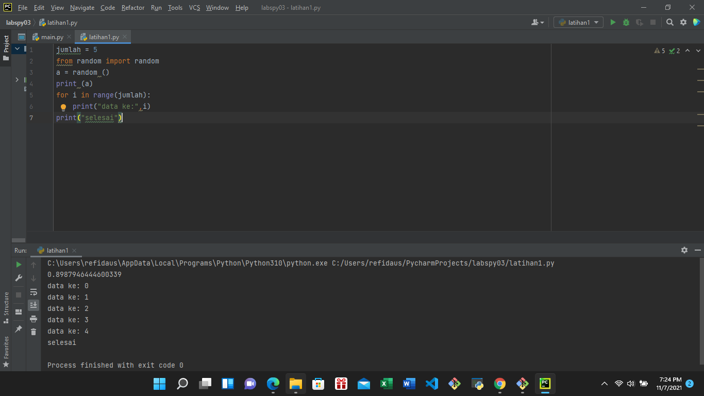
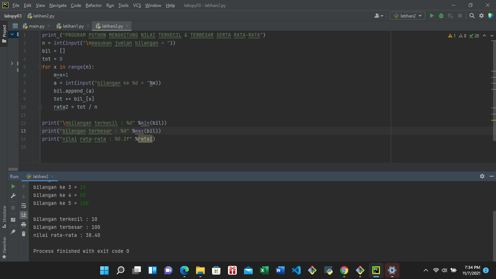
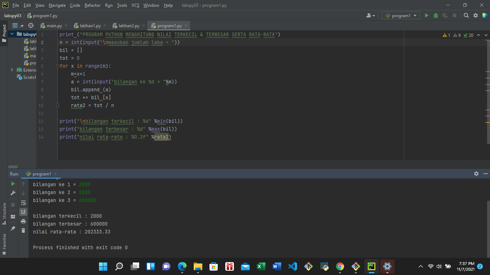

                                                    MODUL PRAKTIKUM 3 PERULANGAN

DI BAWAH INI PROGRAM NYA : 

1. latihan1.py
Scrip codingannya berjumlah = 5 

Dan ikuti gambar di bawah : 

 

2. latihan2.py
Codingannya ikuti gambar di bawah ini : 

 

penjelasannya: Program di atas untuk menghitung nilai terkecil dan terbesar serta nilai rata-rata dari sekelompok bilangan yang kita masukan.

Saat program di jalankan user di minta memasukan jumlah bilangan yang ingin di masukan. Program akan melakukan perulangan berdasarkan jumlah bilangan tersebut.

Setiap nilai yang dimasukan akan di simpan kedalam list bil[] menggunakan metode append(). Metode ini akan menambahkan elemen baru di akhir list.

3. Program1.py
Codingannya ikuti gambar di bawah ini : 

 

Saat program di jalankan/run user di minta memasukan jumlah bilangan yang ingin di masukan. Program akan melakukan perulangan berdasarkan jumlah bilangan tersebut.

                                                    SEKIAN DARI SAYA SEMOGA BERMANFAAT
                                                                TERIMA KASIH